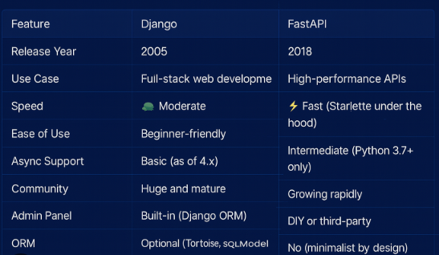

# what is ORM, why fastapi, why not django, decorators in python

1. What is ORM?
- ORM (Object-Relational Mapping) is a technique that lets developers interact with databases using objects instead of writing raw SQL queries. It maps database tables to classes, making data handling easier, more maintainable, and scalable. 

2. Why FastAPI?
-FastAPI is a modern, high-performance Python framework for building APIs. It supports asynchronous programming for handling multiple requests efficiently, is built on Starlette and Pydantic, and provides automatic interactive API documentation.

3. Why not Django?
- Django is a high-level web framework based on the MTV pattern. However, FastAPI may be preferred because it offers higher performance, built-in async support, a simpler and more modern design, and greater flexibility in choosing tools and libraries, whereas Django comes with many built-in components that may not be needed for every project.

FastAPI vs Django :- https://youtu.be/akIBTnWU0u8
      

4. Decorators in Python
- Decorators in Python are a powerful and flexible way to modify the behavior of functions or classes. A decorator is a function that takes another function as an argument and extends or alters its behavior without modifying the original function's code. Decorators are often used for logging, access control, memoization, and other cross-cutting concerns.
- Example of a simple decorator:
```pythondef my_decorator(func):
    def wrapper():
        print("Something is happening before the function is called.")
        func()
        print("Something is happening after the function is called.")
    return wrapper
@my_decorator
def say_hello():
    print("Hello!")
say_hello()
```
In this example, the `my_decorator` function is a decorator that wraps the `say_hello` function. When `say_hello` is called, it will first print a message before calling the original function, and then print another message after the original function has been called.

5. What is ORM and why is it used in backend development?
- ORM stands for Object-Relational Mapping. It is a programming technique that allows developers to interact with a database using an object-oriented paradigm. Instead of writing raw SQL queries, developers can use classes and objects to represent database tables and records. This abstraction layer simplifies database interactions and allows for easier maintenance and scalability. ORM is used in backend development to:
- Simplify database interactions
- Improve code maintainability
- Enhance security
- Increase productivity

6. What is the difference between ORM and raw SQL queries?
- The main difference between ORM and raw SQL queries is the level of abstraction. ORM provides a higher-level interface for interacting with databases, allowing developers to work with objects and classes instead of writing raw SQL queries. Raw SQL queries, on the other hand, require developers to write SQL code directly to interact with the database.

7. What is SQLAlchemy and how does it relate to ORM?
SQLAlchemy is a popular Python library that provides an ORM toolkit to interact with databases using Python classes instead of raw SQL. It simplifies database connections, queries, and transactions, making backend development more efficient and maintainable.

8. What is Django ORM and how is it different from SQLAlchemy?
SQLAlchemy is a popular Python library that provides an ORM toolkit to interact with databases using Python classes instead of raw SQL. It simplifies database connections, queries, and transactions, making backend development more efficient and maintainable.

9. What are the advantages of using ORM in backend development?
- The advantages of using ORM in backend development include:
- Simplified database interactions
- Improved code maintainability
- Enhanced security
- Increased productivity
- Database abstraction
- Cross-database compatibility
- Object-oriented programming


10. What are the disadvantages of using ORM in backend development?
- The disadvantages of using ORM in backend development include:
- Performance overhead
- Learning curve
- Limited control
- Complexity
- Not suitable for complex queries
- Potential for bugs and errors

11. Why would you choose FastAPI for a project?
I would choose FastAPI for a project because it provides high performance, built-in asynchronous support, simplicity, and flexibility. It can handle many requests concurrently, offers automatic interactive API documentation, and allows developers to select their preferred tools and libraries, making it ideal for modern API development.

12. What is ASGI and how does FastAPI use it?
ASGI (Asynchronous Server Gateway Interface) is a Python specification for building asynchronous web applications and servers. It enables handling multiple requests concurrently, improving performance and scalability.

FastAPI uses ASGI to support asynchronous programming, allowing APIs to process many requests simultaneously without blocking the server.

13. What are some common use cases for FastAPI?
- Some common use cases for FastAPI include:
  - Building RESTful APIs 
  - Building GraphQL APIs
  - Building real-time applications using WebSockets
  - Building microservices   
  - Building serverless applications
  - Building data processing pipelines
  - Building machine learning APIs

14. How does FastAPI handle authentication and authorization?
FastAPI supports authentication and authorization using dependency injection. Developers can create custom security logic and easily integrate schemes like OAuth2 and JWT. This makes it simple to implement secure authentication and access control in FastAPI applications.

15. How do decorators work internally?
Decorators in Python work by taking a function as input and returning a new wrapper function that replaces the original one. When the decorated function is called, the wrapper runs instead, allowing extra behavior to be added before or after the original function executes.

Decorators are applied at function definition time, and the wrapper function replaces the original function in the namespace.

16. What are @staticmethod and @classmethod?
- @staticmethod and @classmethod are two types of method decorators in Python that are used to define methods that belong to a class rather than an instance of the class.
- @staticmethod is used to define a method that does not require access to the instance (self) or the class (cls). It can be called on the class itself or on an instance of the class, but it does not have access to any instance or class-specific data.
```pythonclass MyClass:
    @staticmethod
    def static_method():
        print("This is a static method.")
MyClass.static_method()  # Output: This is a static method.
my_instance = MyClass()
my_instance.static_method()  # Output: This is a static method.
```
- @classmethod is used to define a method that requires access to the class (cls) but not the instance (self). It can be called on the class itself or on an instance of the class, and it has access to class-specific data.
```pythonclass MyClass:
    class_variable = "This is a class variable."
    
    @classmethod
    def class_method(cls):
        print(f"This is a class method. {cls.class_variable}")
MyClass.class_method()  # Output: This is a class method. This is a class variable.
my_instance = MyClass()
my_instance.class_method()  # Output: This is a class method. This is a class variable.
```

17. What is CRUD and how is it implemented using ORM?
- CRUD stands for Create, Read, Update, and Delete. It is a common set of operations that are performed on data in a database. Using ORM, CRUD operations can be implemented by defining classes that represent database tables and using methods to perform the necessary operations. For example, in SQLAlchemy, you can define a class for a table and use methods like `add()`, `query()`, `update()`, and `delete()` to perform CRUD operations on the database. In Django ORM, you can use methods like `create()`, `get()`, `update()`, and `delete()` to achieve the same functionality.

18. How do you handle database transactions in ORM?
- In ORM, database transactions can be handled using the transaction management features provided by the ORM library. For example, in SQLAlchemy, you can use the `session` object to manage transactions. You can start a transaction using `session.begin()`, commit the transaction using `session.commit()`, and roll back the transaction using `session.rollback()`. In Django ORM, you can use the `transaction` module to manage transactions. You can use `transaction.atomic()` to wrap a block of code in a transaction, and if an exception occurs within that block, the transaction will be rolled back automatically.
```pythonfrom sqlalchemy import create_engine
from sqlalchemy.orm import sessionmaker
engine = create_engine('sqlite:///example.db')
Session = sessionmaker(bind=engine)
session = Session()
try:
    # Perform database operations
    session.add(new_record)
    session.commit()
except Exception as e:
    session.rollback()
    print(f"An error occurred: {e}")
finally:
    session.close()
```
```pythonfrom django.db import transaction
try:
    with transaction.atomic():
        # Perform database operations
        new_record.save()
except Exception as e:
    print(f"An error occurred: {e}")
```

19. Explain the difference between WSGI and ASGI.
WSGI (Web Server Gateway Interface) is designed for synchronous Python web applications and handles one request at a time.

ASGI (Asynchronous Server Gateway Interface) is built for asynchronous applications and can handle multiple requests concurrently.

In short, WSGI suits traditional web apps, while ASGI is better for high-performance, real-time, and scalable applications.

20. How does Django and FastAPI handle routing?
- In Django, routing is handled using URL patterns defined in the `urls.py` file. Developers can define URL patterns that map to specific views or functions that handle the requests. Django uses a regular expression-based approach to match URLs to views.
```pythonfrom django.urls import path
from . import views
urlpatterns = [
    path('home/', views.home, name='home'),
    path('about/', views.about, name='about'),
]
```
In FastAPI, routing is handled using path operations defined in the main application file. Developers can define path operations that specify the HTTP method (GET, POST, etc.) and the URL path that maps to a specific function that handles the requests. FastAPI uses a more intuitive and modern approach to routing compared to Django.
```pythonfrom fastapi import FastAPI
app = FastAPI()
@app.get("/home/")
def home():
    return {"message": "Welcome to the home page!"}
@app.get("/about/")
def about():
    return {"message": "This is the about page."}
```
