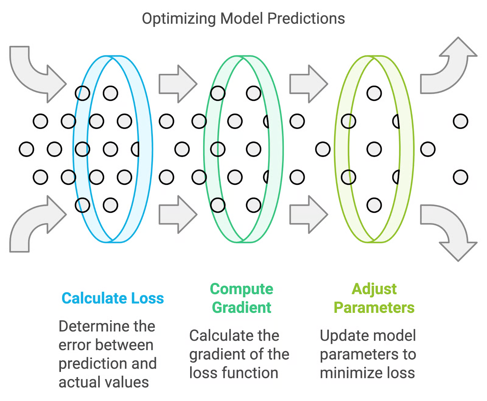
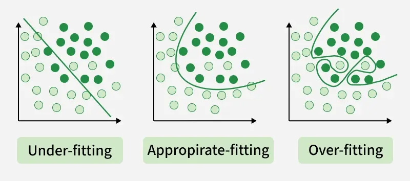

# Optimization & Regularization

## Optimization

1. What is optimization in Machine Learning?

    Optimization algorithms in machine learning are mathematical techniques used to adjust a model's parameters to minimize errors and improve accuracy. These algorithms help models learn from data by finding the best possible solution through iterative updates.

2. What is a loss function and how is it used in optimization?

    A loss function in machine learning is a mathematical function that quantifies the difference (or error) between a model's predicted values and the actual true values. The goal of model training is to minimize this loss, guiding the model to adjust its internal parameters (weights and biases) to make more accurate predictions. 

    - Lower loss = Better model performance

3. Why do we minimize loss function?

    We minimize the loss function in machine learning to directly improve model accuracy by reducing the discrepancy between predicted outputs and actual targets.

4. What is Gradient Descent?Write the update equation.

    Gradient Descent is an optimisation algorithm used to minimize a model’s error by iteratively adjusting its parameters. By moving step‑by‑step in the direction of the steepest decrease in the loss function, it helps machine learning models learn the best possible weights for better predictions.
    - Essential for training neural networks and regression models
    - Works by updating parameters based on calculated gradients
    - Variants include Batch, Stochastic and Mini‑Batch Gradient Descent

    [Gradient Descent Explained](https://youtu.be/i62czvwDlsw)

    Update Equation:

        θ=θ−η∇J(θ)

    Where:
    - θ: Model parameters (weights)
    - η: Learning rate (step size)
    - ∇J(θ): Gradient of the loss function with respect to parameters

5. What is the role of learning rate (η)?

    Learning rate controls how big a step we take while updating weights.

    - Small learning rate → Slow learning
    - Large learning rate → May overshoot minimum
    - Proper learning rate → Fast and stable convergence

6. What are the types of Gradient Descent?

    1. Batch Gradient Descent
        - Uses entire dataset for each update
        - Computationally expensive but stable convergence

    2. Stochastic Gradient Descent (SGD)
        - Updates using one sample at a time
        - Faster updates but noisier convergence

    3. Mini-Batch Gradient Descent
        - Uses small batches of samples for updates
        - Balances speed and stability

7. Difference between Batch, SGD, and Mini-batch?

    | Aspect                | Batch Gradient Descent       | Stochastic Gradient Descent (SGD) | Mini-Batch Gradient Descent     |
    |-----------------------|-----------------------------|----------------------------------|--------------------------------|
    | Update Frequency      | Once per epoch              | After each training example      | After a small batch of examples |
    | Computational Cost    | High (entire dataset)       | Low (one sample)                 | Moderate (small batch)         |
    | Convergence           | Stable but slow             | Noisy and faster                 | Balanced                       |
    | Memory Usage          | High (entire dataset)       | Low (one sample)                 | Moderate (small batch)         |

7. What happens if learning rate is:
    - Too high: Model may overshoot the minimum and fail to converge
    - Too low: Model learns very slowly and may get stuck in local minima

8. What is convergence?

    Convergence means the model has reached a point where:
    - Loss stops decreasing significantly
    - Parameter updates become very small
    - Model reaches (local/global) minimum

9. What is the difference between local and global minima?

    - Local Minimum: A point where the loss is lower than its immediate surroundings but not necessarily the lowest overall.
    - Global Minimum: The absolute lowest point of the loss function across the entire parameter space.

10. What are common problems in optimization?

    - Vanishing Gradients: Gradients become very small, slowing learning in deep networks.
    - Exploding Gradients: Gradients become excessively large, causing unstable updates.
    - Saddle Points: Flat regions in the loss landscape where gradients are zero but not minima.
    - Local Minima: Getting stuck in suboptimal solutions that are not the global minimum.

## Regularization

1. What is regularization in Machine Learning?

  Regularization is a technique used in machine learning to prevent overfitting, which otherwise causes models to perform poorly on unseen data. By adding a penalty for complexity, regularization encourages simpler and more generalizable models.

    - Prevents overfitting: Adds constraints to the model to reduce the risk of memorizing noise in the training data.
    - Improves generalization: Encourages simpler models that perform better on new, unseen data.

 

 - Underfitting:
Model is too simple. It cannot capture the pattern in data → High training error and high test error (high bias).

- Appropriate fitting:
Model captures the main pattern correctly → Low training and test error (good generalization).

- Overfitting:
Model is too complex. It memorizes training data → Very low training error but high test error (high variance).

2. What are the types of regularization?

    1. L1 Regularization (Lasso)
        - Adds absolute value of coefficients to loss function
        - Can shrink some coefficients to zero (feature selection)

    2. L2 Regularization (Ridge)
        - Adds squared value of coefficients to loss function
        - Shrinks coefficients but does not set them to zero

    3. Elastic Net
        - Combines L1 and L2 regularization
        - Balances feature selection and coefficient shrinkage

3. What is the difference between L1 and L2 regularization?

    | Aspect                | L1 Regularization (Lasso)   | L2 Regularization (Ridge)     |
    |-----------------------|-----------------------------|-------------------------------|
    | Penalty Type          | Absolute value of coefficients | Squared value of coefficients |
    | Feature Selection     | Can set some coefficients to zero (sparse) | Shrinks coefficients but does not set to zero |
    | Use Case              | When you want feature selection and interpretability | When you want to prevent overfitting without feature selection |

4. What is Elastic Net regularization?

    Elastic Net regularization is a linear regression technique that combines both L1 (Lasso) and L2 (Ridge) regularization methods. It adds a penalty to the loss function that is a mix of the absolute values of the coefficients (L1) and the squared values of the coefficients (L2). This allows it to perform feature selection while also preventing overfitting, making it particularly useful when dealing with highly correlated features.

    - Combines L1 and L2 penalties
    - Balances feature selection and coefficient shrinkage
    - Useful for datasets with many features or multicollinearity

5. What is the effect of regularization on model complexity?

    Regularization reduces model complexity by adding a penalty to the loss function for larger coefficients. This encourages the model to find simpler solutions that generalize better to unseen data, thus preventing overfitting.

    - Reduces overfitting: By penalizing large coefficients, regularization discourages the model from fitting noise in the training data.
    - Encourages simpler models: Regularization promotes simpler models that are more likely to perform well on new data.

6. How does regularization help in preventing overfitting?

    Regularization helps prevent overfitting by adding a penalty to the loss function that discourages the model from fitting the noise in the training data. By constraining the model's complexity, regularization encourages it to learn the underlying patterns rather than memorizing specific examples, leading to better generalization on unseen data.

    - Penalizes large coefficients: This prevents the model from relying too heavily on any single feature, which can lead to overfitting.
    - Encourages simpler models: Simpler models are less likely to capture noise in the training data, thus improving performance on new data.

7. What is the bias-variance tradeoff?

    The bias-variance tradeoff is a fundamental concept in machine learning that describes the balance between two sources of error that affect model performance:

    - Bias: Error due to overly simplistic models that fail to capture the underlying patterns in the data (underfitting).
    - Variance: Error due to overly complex models that capture noise in the training data (overfitting).

    The goal is to find a model that minimizes both bias and variance, achieving good generalization on unseen data. Regularization techniques can help manage this tradeoff by controlling model complexity.

8. What is the effect of regularization on bias and variance?

    Regularization typically increases bias while decreasing variance. By adding a penalty to the loss function, regularization encourages simpler models that may not fit the training data as closely (increasing bias), but are less likely to capture noise (decreasing variance). This can lead to better generalization on unseen data, especially when the original model was overfitting.

    - Increases bias: The model may underfit the training data due to constraints on complexity.
    - Decreases variance: The model is less sensitive to fluctuations in the training data, reducing overfitting.

9. How to choose the regularization parameter?

    The regularization parameter (often denoted as λ or alpha) controls the strength of the regularization. Choosing the right value is crucial for model performance. Common methods for selecting the regularization parameter include:

    - Cross-validation: Split the data into training and validation sets, and evaluate model performance for different values of the regularization parameter to find the one that minimizes validation error.
    - Grid search: Systematically explore a range of values for the regularization parameter and select the best one based on performance metrics.
    - Random search: Randomly sample values for the regularization parameter and evaluate performance to find an optimal value.
    - Bayesian optimization: Use probabilistic models to find the optimal regularization parameter based on past evaluations.

10. What are the limitations of regularization?

    - May lead to underfitting: If the regularization parameter is too high, the model may become too simple and fail to capture important patterns in the data.
    - Requires tuning: Finding the optimal regularization parameter can be time-consuming and computationally expensive.
    - Not always effective: In some cases, regularization may not significantly improve model performance, especially if the original model is already well-tuned or if the dataset is small.