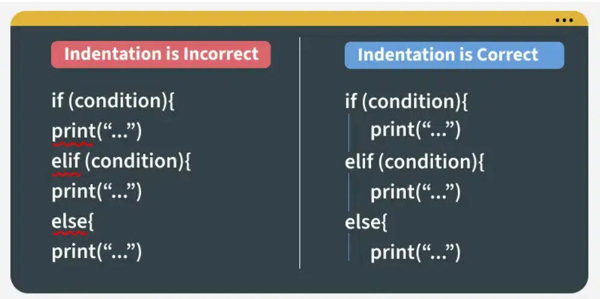

# Python Programming interview questions

[1]  Is Python a compiled language or an interpreted language?
 - Python is an interpreted language. It is executed line by line, and the code is not compiled into machine code before execution. Instead, the Python interpreter reads and executes the code directly.
[2] How can you concatenate two lists in Python?
 - We can concatenante 2 strings using(+) operator.
````python
a=[1,2,3]
b=[4,5,6]
temp=a+b
print(temp)
````
OUTPUT:
```
[1, 2, 3, 4, 5, 6]
```

[3] What is the difference between a list and a tuple in Python?
 - A list is mutable, meaning that you can change its contents after it has been created. A tuple, on the other hand, is immutable, meaning that once it has been created, its contents cannot be changed. Lists are defined using square brackets [], while tuples are defined using parentheses().

[4] Is Indentation Required in Python?
 - Yes, indentation is required in Python. It is used to define the scope of loops, functions, and other code blocks. Proper indentation is crucial for the correct execution of Python code, as it indicates which statements belong to which blocks.


[5] How are arguments passed by value or by reference in Python?
 - Python’s argument-passing model is neither **Pass by Value** nor **Pass by Reference** but it is **Pass by Object Reference**. 
 Depending on the type of object you pass in the function, the function behaves differently. Immutable objects show “pass by value” whereas mutable objects show “pass by reference”.
 ````python
 def call_by_val(x):
    x = x * 2
    return x


def call_by_ref(b):
    b.append("D")
    return b


a = ["E"]
num = 6

# Call functions
updated_num = call_by_val(num)
updated_list = call_by_ref(a)

# Print after function calls
print("Updated value after call_by_val:", updated_num)
print("Updated list after call_by_ref:", updated_list)
````
OUTPUT:
````
Updated value after call_by_val: 12
Updated list after call_by_ref: ['E', 'D']
````
[6] What are Python’s key features?
 - Python is a high-level, interpreted programming language known for its simplicity and readability. Some of its key features include:
    - **Easy to learn and use:** Python has a simple syntax that is easy to understand, making it an excellent choice for beginners.
    - **Versatility:** Python can be used for a wide range of applications, including web development, data analysis, machine learning, and more.
    - **Large standard library:** Python comes with a vast standard library that provides many useful modules and functions for various tasks.
    - **Cross-platform compatibility:** Python can run on different operating systems, including Windows, macOS, and Linux.
    - **Strong community support:** Python has a large and active community that contributes to its development and provides support through forums and online resources.
[7] What is the difference between a Set and Dictionary?
- A Python Set is an unordered collection data type that is iterable, mutable and has no duplicate elements. Python’s set class represents the mathematical notion of a set.

**Syntax:** Defined using curly braces {} or the set() function.
````python
my_set = {1, 2, 3}
````

- Dictionary in Python is an ordered collection of data values, used to store data values like a map, which, unlike other Data Types that hold only a single value as an element, Dictionary holds key:value pair. Key-value is provided in the dictionary to make it more optimized.
**Syntax:** Defined using curly braces {} with key-value pairs.
````python
my_dict = {"a": 1, "b": 2, "c": 3}
````
[8] What are Python’s built-in data types?
 - Python has several built-in data types, including:
    - **Numeric types:** int, float, complex
    - **Sequence types:** list, tuple, range
    - **Text type:** str
    - **Mapping type:** dict
    - **Set types:** set, frozenset
    - **Boolean type:** bool
    - **Binary types:** bytes, bytearray, memoryview

[9] How do you handle exceptions in Python?
 - In Python, you can handle exceptions using the try-except block. You can also use the finally block to execute code that should run regardless of whether an exception occurred or not. Here’s an example:
````python
try:
    # Code that may raise an exception
    result = 10 / 0
except ZeroDivisionError as e:
    # Handle the exception
    print("Error: Cannot divide by zero.")
finally:
    # Code that will run regardless of an exception
    print("This will always be executed.")
````
OUTPUT:
```Error: Cannot divide by zero.
This will always be executed.
```    

[10] What are Modules and Packages in Python?
- A module is a single file that contains Python code (functions, variables, classes) which can be reused in other programs. You can think of it as a code library. For example: math is a built-in module that provides math functions like sqrt(), pi, etc.
````python
import math
print(math.sqrt(16))
````
OUTPUT:
```
4.0
```
Package is a collection of related modules stored in a directory. It helps in organizing and grouping modules together for easier management.
**For example:** The numpy package contains multiple modules for numerical operations.

To create a package, the directory must contain a special file named __init__.py.

[11] Does Python supports multiple Inheritance?
- Yes, Python supports multiple inheritance. A class can inherit from multiple parent classes, and it can inherit attributes and methods from all of them.

[12] What is the difference between a class and an object in Python?
- A class is a blueprint for creating objects, while an object is an instance of a class. A class defines the attributes and methods that objects of that class will have, while an object is a specific instance of a class with its own unique values for the attributes.

[13] How do you create a class in Python?
- In Python, you can create a class using the class keyword. Here’s an example:
```python
class Person:
    def __init__(self, name, age):
        self.name = name
        self.age = age
```

[14] What is python garbage collection?
- Python has a garbage collection system that automatically manages memory by collecting and removing objects that are no longer in use. This helps prevent memory leaks and ensures that memory is used efficiently.

[15] What is the difference between a stack and a queue in Python?
- A stack is a Last In First Out (LIFO) data structure, while a queue is a First In First Out (FIFO) data structure. In a stack, the last element added is the first one to be removed, while in a queue, the first element added is the first one to be removed.
